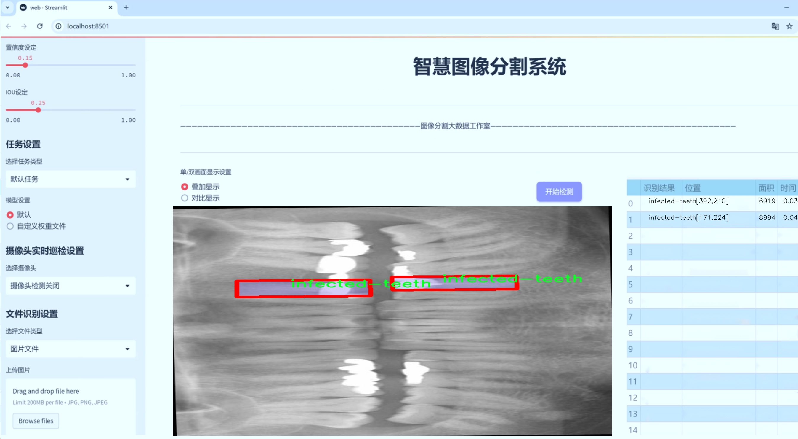

# 牙片补牙牙齿病变图像分割系统： yolov8-seg-p6

### 1.研究背景与意义

[参考博客](https://gitee.com/YOLOv8_YOLOv11_Segmentation_Studio/projects)

[博客来源](https://kdocs.cn/l/cszuIiCKVNis)

研究背景与意义

随着口腔健康意识的提升，牙齿疾病的早期诊断与治疗愈发受到重视。牙齿病变的种类繁多，包括龋齿、填充物的老化、植牙的失败等，这些问题不仅影响患者的口腔健康，还可能对其整体健康产生深远影响。传统的牙齿病变诊断主要依赖于牙医的经验和手动检查，然而，这种方法不仅耗时耗力，而且容易受到主观因素的影响，导致诊断的准确性和一致性不足。因此，开发一种高效、准确的牙齿病变图像分割系统显得尤为重要。

近年来，深度学习技术在图像处理领域取得了显著进展，尤其是在目标检测和图像分割方面。YOLO（You Only Look Once）系列模型因其高效的实时检测能力而受到广泛关注。YOLOv8作为该系列的最新版本，进一步提升了模型的精度和速度，适用于各种复杂场景下的图像分割任务。然而，针对牙齿病变的特定需求，YOLOv8的原始模型可能无法充分满足高精度分割的要求。因此，基于改进YOLOv8的牙片补牙牙齿病变图像分割系统的研究具有重要的现实意义。

本研究将利用一个包含9500张图像的专业数据集，涵盖了8种不同类别的牙齿病变，包括龋齿、填充物、植牙、早期龋齿、感染牙齿等。这些类别的多样性为模型的训练提供了丰富的样本，有助于提高模型的泛化能力和准确性。通过对数据集的深入分析与处理，我们将针对每种病变的特征进行细致的标注和分类，以确保模型能够有效识别和分割不同类型的牙齿病变。

此外，研究的意义还体现在其对临床实践的潜在影响。通过实现高效的牙齿病变图像分割系统，牙医可以在诊断过程中获得更为精准的病变信息，从而制定更为合理的治疗方案。这不仅能够提高患者的治疗效果，还能降低医疗成本，提升医疗服务的整体效率。同时，该系统的应用也有助于推动牙科领域的数字化转型，促进人工智能技术在医疗健康中的深入应用。

综上所述，基于改进YOLOv8的牙片补牙牙齿病变图像分割系统的研究，不仅具有重要的学术价值，也对实际临床应用具有深远的影响。通过这一研究，我们希望能够为牙齿病变的早期诊断和治疗提供有力的技术支持，推动口腔健康管理的科学化和智能化进程。

### 2.图片演示




注意：本项目提供完整的训练源码数据集和训练教程,由于此博客编辑较早,暂不提供权重文件（best.pt）,需要按照6.训练教程进行训练后实现上图效果。

### 3.视频演示

[3.1 视频演示](https://www.bilibili.com/video/BV1QjB4YhEgb/)

### 4.数据集信息

##### 4.1 数据集类别数＆类别名

nc: 8
names: ['Cavity', 'Fillings', 'Implant', 'caries', 'decay', 'earlydecay', 'infected-teeth', 'teeth']


##### 4.2 数据集信息简介

数据集信息展示

在本研究中，我们使用了名为“dental_project”的数据集，以训练和改进YOLOv8-seg模型，旨在实现对牙片中牙齿病变的高效分割。该数据集专门针对牙科影像进行构建，包含了多种类型的牙齿病变图像，涵盖了临床上常见的牙齿疾病和治疗情况。数据集的类别数量为8，具体类别包括：Cavity（龋齿）、Fillings（填充物）、Implant（种植体）、caries（蛀牙）、decay（腐烂）、earlydecay（早期腐烂）、infected-teeth（感染牙齿）以及teeth（健康牙齿）。这些类别的划分不仅为模型的训练提供了丰富的标注信息，也为后续的病变检测和分割任务奠定了坚实的基础。

“dental_project”数据集的构建过程涉及了大量的临床影像数据采集和处理。每一类病变图像均经过专业牙科医生的标注，确保了数据的准确性和可靠性。数据集中包含的图像种类繁多，既有不同角度和光照条件下拍摄的牙片，也有不同患者的病例，极大地增强了模型的泛化能力。这种多样性使得YOLOv8-seg在处理不同类型的牙齿病变时，能够更好地适应各种临床场景，从而提高了分割的精度和效率。

在具体的类别方面，Cavity和caries代表了牙齿最常见的病变类型，反映了牙齿健康状况的严重性。Fillings和Implant则涉及到牙齿治疗和修复的情况，能够帮助模型识别出治疗后的牙齿状态。早期腐烂（earlydecay）和腐烂（decay）则提供了病变发展的不同阶段的信息，有助于模型在早期阶段就能识别出潜在问题，从而为临床干预提供及时的依据。infected-teeth类别则聚焦于牙齿感染的情况，进一步丰富了模型的识别能力。最后，teeth类别作为健康牙齿的代表，为模型提供了一个清晰的对比基准，帮助其更好地识别病变与健康状态之间的差异。

在数据集的使用过程中，我们将采用数据增强技术，以增加模型的鲁棒性和适应性。通过旋转、缩放、翻转等方式，我们可以生成更多的训练样本，从而提升模型在实际应用中的表现。此外，数据集的划分也将遵循一定的比例，确保训练集、验证集和测试集的合理分配，以便于模型性能的评估和优化。

总之，“dental_project”数据集为我们提供了一个全面、系统的牙齿病变图像库，结合YOLOv8-seg模型的强大能力，能够有效推动牙科影像分析技术的发展。通过对该数据集的深入研究和应用，我们期望能够在牙齿病变的早期检测和分割方面取得显著的进展，为临床牙科诊断提供更为精准的支持。


### 5.项目依赖环境部署教程（零基础手把手教学）

[5.1 环境部署教程链接（零基础手把手教学）](https://www.bilibili.com/video/BV1jG4Ve4E9t/?vd_source=bc9aec86d164b67a7004b996143742dc)


[5.2 安装Python虚拟环境创建和依赖库安装视频教程链接（零基础手把手教学）](https://www.bilibili.com/video/BV1nA4VeYEze/?vd_source=bc9aec86d164b67a7004b996143742dc)

### 6.手把手YOLOV8-seg训练视频教程（零基础手把手教学）

[6.1 手把手YOLOV8-seg训练视频教程（零基础小白有手就能学会）](https://www.bilibili.com/video/BV1cA4VeYETe/?vd_source=bc9aec86d164b67a7004b996143742dc)


按照上面的训练视频教程链接加载项目提供的数据集，运行train.py即可开始训练



     Epoch   gpu_mem       box       obj       cls    labels  img_size
     1/200     0G   0.01576   0.01955  0.007536        22      1280: 100%|██████████| 849/849 [14:42<00:00,  1.04s/it]
               Class     Images     Labels          P          R     mAP@.5 mAP@.5:.95: 100%|██████████| 213/213 [01:14<00:00,  2.87it/s]
                 all       3395      17314      0.994      0.957      0.0957      0.0843

     Epoch   gpu_mem       box       obj       cls    labels  img_size
     2/200     0G   0.01578   0.01923  0.007006        22      1280: 100%|██████████| 849/849 [14:44<00:00,  1.04s/it]
               Class     Images     Labels          P          R     mAP@.5 mAP@.5:.95: 100%|██████████| 213/213 [01:12<00:00,  2.95it/s]
                 all       3395      17314      0.996      0.956      0.0957      0.0845

     Epoch   gpu_mem       box       obj       cls    labels  img_size
     3/200     0G   0.01561    0.0191  0.006895        27      1280: 100%|██████████| 849/849 [10:56<00:00,  1.29it/s]
               Class     Images     Labels          P          R     mAP@.5 mAP@.5:.95: 100%|███████   | 187/213 [00:52<00:00,  4.04it/s]
                 all       3395      17314      0.996      0.957      0.0957      0.0845


### 7.50+种全套YOLOV8-seg创新点加载调参实验视频教程（一键加载写好的改进模型的配置文件）

[7.1 50+种全套YOLOV8-seg创新点加载调参实验视频教程（一键加载写好的改进模型的配置文件）](https://www.bilibili.com/video/BV1Hw4VePEXv/?vd_source=bc9aec86d164b67a7004b996143742dc)

### YOLOV8-seg算法简介

原始YOLOv8-seg算法原理

YOLOv8-seg作为YOLO系列中的最新版本，于2023年1月正式推出，标志着计算机视觉领域在目标检测和实例分割任务上的一项重大进步。该算法不仅在精度和执行速度上超越了前代模型，还在多种应用场景中展现出卓越的性能。YOLOv8-seg的设计理念源于对YOLOv5、YOLOv6和YOLOX等模型的深刻理解与借鉴，充分吸收了它们的优点，并在此基础上进行了全面的改进和创新。

首先，YOLOv8-seg的骨干网络经过重新设计，采用了新的C2f模块，这一模块通过引入更多的跳层连接和Split操作，增强了模型的特征提取能力。与传统的C3模块相比，C2f模块在梯度流动上表现得更加高效，能够更好地捕捉到图像中的细节特征。这种设计使得YOLOv8-seg在处理复杂场景时，能够有效地提高目标检测的准确性和鲁棒性。

在特征融合方面，YOLOv8-seg采用了路径聚合网络（PAN）结构，这一结构能够有效地融合不同尺度的特征，提升对小目标的检测能力。PAN的设计理念是通过多层次的特征融合，使得模型在面对不同大小的目标时，能够自适应地调整其特征表示，从而提高整体的检测性能。这一特性在实例分割任务中尤为重要，因为实例分割不仅需要识别目标的类别，还需要精确地分割出目标的轮廓。

YOLOv8-seg在头部网络的设计上也进行了显著的改进。与YOLOv5的耦合头不同，YOLOv8-seg采用了解耦头结构，这一结构将分类和回归任务分开处理，使得模型在进行目标检测时能够更加高效。解耦头的引入使得模型在进行损失计算时，能够更清晰地分配正负样本，进而提高分类和回归的精度。此外，YOLOv8-seg摒弃了传统的Anchor-Based方法，转而采用Anchor-Free的检测头，这一变化不仅减少了锚框的预测数量，还加速了非最大抑制（NMS）过程，从而提升了整体的检测速度。

在损失函数的设计上，YOLOv8-seg引入了新的损失计算策略，结合了二元交叉熵损失（BCELoss）和分布焦点损失（DFLoss），以及完全交并比损失（CIOULoss）。这种多样化的损失计算方式使得模型在训练过程中能够更好地平衡分类和回归的目标，从而提高了边界框预测的准确性。这一创新使得YOLOv8-seg在面对复杂场景时，能够更有效地进行目标的定位与分割。

此外，YOLOv8-seg在输入端的设计上也进行了优化，采用了马赛克数据增强、自适应锚框计算和自适应灰度填充等技术。这些技术的引入不仅丰富了训练数据的多样性，还提高了模型在不同环境下的适应能力。通过这些增强手段，YOLOv8-seg能够在训练过程中更好地学习到目标的特征，从而在实际应用中展现出更强的鲁棒性。

YOLOv8-seg的设计目标是实现高效的实时目标检测与实例分割，这一目标的实现依赖于其轻量化的网络结构和高效的计算策略。YOLOv8-seg根据不同的使用场景分为多个版本，包括n、s、m、l、x等，用户可以根据具体需求选择合适的模型。YOLOv8n版本作为参数量最小且检测速度最快的模型，特别适合对实时性要求较高的应用场景。

总的来说，YOLOv8-seg通过对网络结构的全面优化和创新，成功地提升了目标检测与实例分割的性能。其在骨干网络、特征融合、头部网络和损失计算等多个方面的改进，使得YOLOv8-seg在面对复杂的视觉任务时，能够以更高的精度和速度完成目标检测与分割。这些创新不仅推动了YOLO系列模型的发展，也为计算机视觉领域的进一步研究提供了新的思路和方向。随着YOLOv8-seg的推广与应用，未来在智能监控、自动驾驶、医疗影像分析等多个领域，必将展现出更为广泛的应用前景。


### 9.系统功能展示（检测对象为举例，实际内容以本项目数据集为准）

图9.1.系统支持检测结果表格显示

  图9.2.系统支持置信度和IOU阈值手动调节

  图9.3.系统支持自定义加载权重文件best.pt(需要你通过步骤5中训练获得)

  图9.4.系统支持摄像头实时识别

  图9.5.系统支持图片识别

  图9.6.系统支持视频识别

  图9.7.系统支持识别结果文件自动保存

  图9.8.系统支持Excel导出检测结果数据


### 10.50+种全套YOLOV8-seg创新点原理讲解（非科班也可以轻松写刊发刊，V11版本正在科研待更新）

#### 10.1 由于篇幅限制，每个创新点的具体原理讲解就不一一展开，具体见下列网址中的创新点对应子项目的技术原理博客网址【Blog】：


[10.1 50+种全套YOLOV8-seg创新点原理讲解链接](https://gitee.com/qunmasj/good)

#### 10.2 部分改进模块原理讲解(完整的改进原理见上图和技术博客链接)【如果此小节的图加载失败可以通过CSDN或者Github搜索该博客的标题访问原始博客，原始博客图片显示正常】
### 深度学习基础
卷积神经网络通过使用具有共享参数的卷积运算显著降低了模型的计算开销和复杂性。在LeNet、AlexNet和VGG等经典网络的驱动下，卷积神经网络现在已经建立了一个完整的系统，并在深度学习领域形成了先进的卷积神经网络模型。

感受野注意力卷积RFCBAMConv的作者在仔细研究了卷积运算之后获得了灵感。对于分类、目标检测和语义分割任务，一方面，图像中不同位置的对象的形状、大小、颜色和分布是可变的。在卷积操作期间，卷积核在每个感受野中使用相同的参数来提取信息，而不考虑来自不同位置的差分信息。这限制了网络的性能，这已经在最近的许多工作中得到了证实。

另一方面，卷积运算没有考虑每个特征的重要性，这进一步影响了提取特征的有效性，并最终限制了模型的性能。此外，注意力机制允许模型专注于重要特征，这可以增强特征提取的优势和卷积神经网络捕获详细特征信息的能力。因此，注意力机制在深度学习中得到了广泛的应用，并成功地应用于各个领域。

通过研究卷积运算的内在缺陷和注意力机制的特点，作者认为现有的空间注意力机制从本质上解决了卷积运算的参数共享问题，但仍局限于对空间特征的认知。对于较大的卷积核，现有的空间注意力机制并没有完全解决共享参数的问题。此外，他们无法强调感受野中每个特征的重要性，例如现有的卷积块注意力模块（CBAM）和 Coordinate注意力（CA）。

因此，[参考该博客提出了一种新的感受野注意力机制（RFA）](https://qunmasj.com)，它完全解决了卷积核共享参数的问题，并充分考虑了感受野中每个特征的重要性。通过RFA设计的卷积运算（RFAConv）是一种新的卷积运算，可以取代现有神经网络中的标准卷积运算。RFAConv通过添加一些参数和计算开销来提高网络性能。

大量关于Imagnet-1k、MS COCO和VOC的实验已经证明了RFAConv的有效性。作为一种由注意力构建的新型卷积运算，它超过了由CAM、CBAM和CA构建的卷积运算（CAMConv、CBAMConv、CAConv）以及标准卷积运算。

此外，为了解决现有方法提取感受野特征速度慢的问题，提出了一种轻量级操作。在构建RFAConv的过程中，再次设计了CA和CBAM的升级版本，并进行了相关实验。作者认为当前的空间注意力机制应该将注意力放在感受野空间特征上，以促进当前空间注意力机制的发展，并再次增强卷积神经网络架构的优势。


### 卷积神经网络架构
出色的神经网络架构可以提高不同任务的性能。卷积运算作为卷积神经网络的一种基本运算，推动了人工智能的发展，并为车辆检测、无人机图像、医学等先进的网络模型做出了贡献。He等人认为随着网络深度的增加，该模型将变得难以训练并产生退化现象，因此他们提出了残差连接来创新卷积神经网络架构的设计。Huang等人通过重用特征来解决网络梯度消失问题，增强了特征信息，他们再次创新了卷积神经网络架构。

通过对卷积运算的详细研究，Dai等人认为，具有固定采样位置的卷积运算在一定程度上限制了网络的性能，因此提出了Deformable Conv，通过学习偏移来改变卷积核的采样位置。在Deformable Conv的基础上，再次提出了Deformable Conv V2和Deformable Conv V3，以提高卷积网络的性能。

Zhang等人注意到，组卷积可以减少模型的参数数量和计算开销。然而，少于组内信息的交互将影响最终的网络性能。1×1的卷积可以与信息相互作用。然而，这将带来更多的参数和计算开销，因此他们提出了无参数的“通道Shuffle”操作来与组之间的信息交互。

Ma等人通过实验得出结论，对于参数较少的模型，推理速度不一定更快，对于计算量较小的模型，推理也不一定更快。经过仔细研究提出了Shufflenet V2。

YOLO将输入图像划分为网格，以预测对象的位置和类别。经过不断的研究，已经提出了8个版本的基于YOLO的目标检测器，如YOLOv5、YOLOv7、YOLOv8等。上述卷积神经网络架构已经取得了巨大的成功。然而，它们并没有解决提取特征过程中的参数共享问题。本文的工作从注意力机制开始，从一个新的角度解决卷积参数共享问题。

### 注意力机制
注意力机制被用作一种提高网络模型性能的技术，使其能够专注于关键特性。注意力机制理论已经在深度学习中建立了一个完整而成熟的体系。Hu等人提出了一种Squeeze-and-Excitation（SE）块，通过压缩特征来聚合全局通道信息，从而获得与每个通道对应的权重。Wang等人认为，当SE与信息交互时，单个通道和权重之间的对应关系是间接的，因此设计了高效通道注Efficient Channel Attention力（ECA），并用自适应kernel大小的一维卷积取代了SE中的全连接（FC）层。Woo等人提出了卷积块注意力模块（CBAM），它结合了通道注意力和空间注意力。作为一个即插即用模块，它可以嵌入卷积神经网络中，以提高网络性能。

尽管SE和CBAM已经提高了网络的性能。Hou等人仍然发现压缩特征在SE和CBAM中丢失了太多信息。因此，他们提出了轻量级Coordinate注意力（CA）来解决SE和CBAM中的问题。Fu等人计了一个空间注意力模块和通道注意力模块，用于扩展全卷积网络（FCN），分别对空间维度和通道维度的语义相关性进行建模。Zhang等人在通道上生成不同尺度的特征图，以建立更有效的通道注意力机制。

本文从一个新的角度解决了标准卷积运算的参数共享问题。这就是将注意力机制结合起来构造卷积运算。尽管目前的注意力机制已经获得了良好的性能，但它们仍然没有关注感受野的空间特征。因此，设计了具有非共享参数的RFA卷积运算，以提高网络的性能。


#### 回顾标准卷积
以标准卷积运算为基础构建卷积神经网络，通过共享参数的滑动窗口提取特征信息，解决了全连接层构建的神经网络的固有问题（即参数数量大、计算开销高）。

设表示输入特征图，其中、和分别表示特征图的通道数、高度和宽度。为了能够清楚地展示卷积核提取特征信息的过程，以为例。提取每个感受野slider的特征信息的卷积运算可以表示如下：


这里，表示在每次卷积slider操作之后获得的值，表示在每个slider内的相应位置处的像素值。表示卷积核，表示卷积核中的参数数量，表示感受野slider的总数。

可以看出，每个slider内相同位置的特征共享相同的参数。因此，标准的卷积运算无法感知不同位置带来的差异信息，这在一定程度上限制了卷积神经网络的性能。

#### 回顾空间注意力
目前，空间注意力机制使用通过学习获得的注意力图来突出每个特征的重要性。与上一节类似，以为例。突出关键特征的空间注意力机制可以简单地表达如下：


这里，表示在加权运算之后获得的值。和分别表示输入特征图和学习注意力图在不同位置的值，是输入特征图的高度和宽度的乘积，表示像素值的总数。一般来说，整个过程可以简单地表示在图1中。


#### 空间注意力与标准卷积
众所周知，将注意力机制引入卷积神经网络可以提高网络的性能。通过标准的卷积运算和对现有空间注意力机制的仔细分析。作者认为空间注意力机制本质上解决了卷积神经网络的固有缺点，即共享参数的问题。

目前，该模型最常见的卷积核大小为1×1和3×3。引入空间注意力机制后用于提取特征的卷积操作是1×1或3×3卷积操作。这个过程可以直观地显示出来。空间注意力机制被插入到1×1卷积运算的前面。通过注意力图对输入特征图进行加权运算（Re-weight“×”），最后通过1×1卷积运算提取感受野的slider特征信息。

整个过程可以简单地表示如下：


 

这里，卷积核仅表示一个参数值。如果将的值作为一个新的卷积核参数，那么有趣的是，通过1×1卷积运算提取特征时的参数共享问题得到了解决。然而，空间注意力机制的传说到此结束。当空间注意力机制被插入到3×3卷积运算的前面时。具体情况如下：


如上所述，如果取的值。作为一种新的卷积核参数，上述方程完全解决了大规模卷积核的参数共享问题。然而，最重要的一点是，卷积核在每个感受野slider中提取将共享部分特征的特征。换句话说，在每个感受野slider内都会有重叠。

经过仔细分析发现，，…，空间注意力图的权重在每个slider内共享。因此，空间注意机制不能解决大规模卷积核共享参数的问题，因为它们不注意感受野的空间特征。在这种情况下，空间注意力机制是有限的。
#### 创新空间注意力与标准卷积
RFA是为了解决空间注意力机制问题而提出的，创新了空间注意力。使用与RFA相同的思想，一系列空间注意力机制可以再次提高性能。RFA设计的卷积运算可以被视为一种轻量级的即插即用模块，以取代标准卷积，从而提高卷积神经网络的性能。因此，作者认为空间注意力机制和标准卷积在未来将有一个新的春天。

感受野的空间特征：

现在给出感受野空间特征的定义。它是专门为卷积核设计的，并根据kernel大小动态生成，如图2所示，以3×3卷积核为例。


在图2中，“空间特征”表示原始特征图，等于空间特征。“感受野空间特征”表示变换后的特征，该特征由每个感受野slider滑块组成，并且不重叠。也就是说，“感受野空间特征”中的每个3×3大小的slider表示提取原始3×3卷积特征时所有感觉野slider的特征。

#### 感受野注意力卷积(RFA):

关于感受野空间特征，该博客的作者提出了感受野注意（RFA），它不仅强调了感受野slider内各种特征的重要性，而且还关注感受野空间特性，以彻底解决卷积核参数共享的问题。感受野空间特征是根据卷积核的大小动态生成的，因此，RFA是卷积的固定组合，不能脱离卷积运算的帮助，卷积运算同时依赖RFA来提高性能。

因此，作者提出了感受野注意力卷积（RFAConv）。具有3×3大小卷积核的RFAConv的总体结构如图3所示。


目前，提取感受野特征最常用的方法速度较慢，因此经过不断探索提出了一种快速的方法，通过分组卷积来取代原来的方法。

具体来说，根据感受野大小，使用相应的组卷积大小来动态生成展开特征。尽管与原始的无参数方法（如Pytorch提供的nn.Unfld()）相比，该方法添加了一些参数，但速度要快得多。

注意：正如在上一节中提到的，当原始的3×3卷积核提取特征时，感受野空间特征中的每个3×3大小的窗口表示所有感受野滑块的特征。但在快速分组卷积提取感受野特征后，由于原始方法太慢，它们会被映射到新的特征中。

最近的一些工作已经证明信息交互可以提高网络性能。类似地，对于RFAConv，与感受野特征信息交互以学习注意力图可以提高网络性能，但与每个感受野特征交互将带来额外的计算开销。为了确保少量的计算开销和参数数量，通过探索使用AvgPool池化每个感受野特征的全局信息，然后通过1×1组卷积运算与信息交互。最后，softmax用于强调感受野特征中每个特征的重要性。通常，RFA的计算可以表示为：


表示分组卷积，表示卷积核的大小，代表规范化，表示输入特征图，是通过将注意力图与变换的感受野空间特征相乘而获得的。

与CBAM和CA不同，RFA可以为每个感受野特征生成注意力图。标准卷积受到卷积神经网络性能的限制，因为共享参数的卷积运算对位置带来的差异信息不敏感。RFA完全可以解决这个问题，具体细节如下：


由于RFA获得的特征图是“调整形状”后不重叠的感受野空间特征，因此通过池化每个感受野滑块的特征信息来学习学习的注意力图。换句话说，RFA学习的注意力图不再在每个感受野slider内共享，并且是有效的。这完全解决了现有的CA和CBAM对大尺寸kernel的注意力机制中的参数共享问题。

同时，RFA给标准卷积核带来了相当大的好处，但调整形状后，特征的高度和宽度是k倍，需要进行k×k的stride卷积运算，才能提取特征信息。RFAConv创新了标准卷积运算。

此外，空间注意力机制将得到升级，因为作者认为现有的空间注意力机制应该专注于感受野空间特征，以提高网络的性能。众所周知，基于自注意力机制的网络模型取得了巨大的成功，因为它解决了卷积参数共享的问题，并对远程信息进行了建模，但基于自注意力机理的方法给模型带来了巨大的计算开销和复杂性。作者认为通过将一些现有空间注意力机制的注意力放在感受野空间特征中，它以轻量级的方式解决了自注意力机制的问题。

答案如下：

将关注感受野空间特征的空间注意力与卷积相匹配，完全解决了卷积参数共享的问题；

当前的空间注意力机制本身具有考虑远距离信息的特点，它们通过全局平均池化或全局最大池化来获得全局信息，这在一定程度上考虑了远距离信息。


为此，作者设计了一种新的CBAM和CA，称为RFACBAM和RFACA，它专注于感受野的空间特征。与RFA类似，使用stride为k的k×k的最终卷积运算来提取特征信息，具体结构如图4和图5所示，将这2种新的卷积方法称为RFCBAMConv和RFCAConv。比较原始的CBAM，使用SE注意力来代替RFCBAM中的CAM。因为这样可以减少计算开销。


此外，在RFCBAM中，通道和空间注意力不是在单独的步骤中执行的，因为通道和空间注意力是同时加权的，从而允许在每个通道上获得的注意力图是不同的。


### 11.项目核心源码讲解（再也不用担心看不懂代码逻辑）

#### 11.1 ultralytics\trackers\utils\matching.py

以下是对代码的核心部分进行的分析和详细注释：

```python
import numpy as np
import scipy
from scipy.spatial.distance import cdist
from ultralytics.utils.metrics import bbox_ioa

try:
    import lap  # 导入线性分配库
    assert lap.__version__  # 验证包不是目录
except (ImportError, AssertionError, AttributeError):
    from ultralytics.utils.checks import check_requirements
    check_requirements('lapx>=0.5.2')  # 检查并更新到lap包
    import lap

def linear_assignment(cost_matrix, thresh, use_lap=True):
    """
    使用线性分配算法进行匹配。

    参数:
        cost_matrix (np.ndarray): 包含分配成本的矩阵。
        thresh (float): 认为分配有效的阈值。
        use_lap (bool, optional): 是否使用lap.lapjv。默认为True。

    返回:
        (tuple): 包含匹配索引、未匹配的索引（来自'a'）和未匹配的索引（来自'b'）的元组。
    """
    if cost_matrix.size == 0:
        return np.empty((0, 2), dtype=int), tuple(range(cost_matrix.shape[0])), tuple(range(cost_matrix.shape[1]))

    if use_lap:
        # 使用lap库进行线性分配
        _, x, y = lap.lapjv(cost_matrix, extend_cost=True, cost_limit=thresh)
        matches = [[ix, mx] for ix, mx in enumerate(x) if mx >= 0]
        unmatched_a = np.where(x < 0)[0]  # 找到未匹配的'a'索引
        unmatched_b = np.where(y < 0)[0]  # 找到未匹配的'b'索引
    else:
        # 使用scipy进行线性分配
        x, y = scipy.optimize.linear_sum_assignment(cost_matrix)  # 行x，列y
        matches = np.asarray([[x[i], y[i]] for i in range(len(x)) if cost_matrix[x[i], y[i]] <= thresh])
        if len(matches) == 0:
            unmatched_a = list(np.arange(cost_matrix.shape[0]))
            unmatched_b = list(np.arange(cost_matrix.shape[1]))
        else:
            unmatched_a = list(set(np.arange(cost_matrix.shape[0])) - set(matches[:, 0]))
            unmatched_b = list(set(np.arange(cost_matrix.shape[1])) - set(matches[:, 1]))

    return matches, unmatched_a, unmatched_b

def iou_distance(atracks, btracks):
    """
    基于交并比（IoU）计算轨迹之间的成本。

    参数:
        atracks (list[STrack] | list[np.ndarray]): 轨迹'a'或边界框的列表。
        btracks (list[STrack] | list[np.ndarray]): 轨迹'b'或边界框的列表。

    返回:
        (np.ndarray): 基于IoU计算的成本矩阵。
    """
    if (len(atracks) > 0 and isinstance(atracks[0], np.ndarray)) \
            or (len(btracks) > 0 and isinstance(btracks[0], np.ndarray)):
        atlbrs = atracks
        btlbrs = btracks
    else:
        atlbrs = [track.tlbr for track in atracks]  # 获取轨迹'a'的边界框
        btlbrs = [track.tlbr for track in btracks]  # 获取轨迹'b'的边界框

    ious = np.zeros((len(atlbrs), len(btlbrs)), dtype=np.float32)  # 初始化IoU矩阵
    if len(atlbrs) and len(btlbrs):
        ious = bbox_ioa(np.ascontiguousarray(atlbrs, dtype=np.float32),
                        np.ascontiguousarray(btlbrs, dtype=np.float32),
                        iou=True)  # 计算IoU
    return 1 - ious  # 返回成本矩阵

def embedding_distance(tracks, detections, metric='cosine'):
    """
    基于嵌入计算轨迹和检测之间的距离。

    参数:
        tracks (list[STrack]): 轨迹列表。
        detections (list[BaseTrack]): 检测列表。
        metric (str, optional): 距离计算的度量。默认为'cosine'。

    返回:
        (np.ndarray): 基于嵌入计算的成本矩阵。
    """
    cost_matrix = np.zeros((len(tracks), len(detections)), dtype=np.float32)  # 初始化成本矩阵
    if cost_matrix.size == 0:
        return cost_matrix
    det_features = np.asarray([track.curr_feat for track in detections], dtype=np.float32)  # 获取检测特征
    track_features = np.asarray([track.smooth_feat for track in tracks], dtype=np.float32)  # 获取轨迹特征
    cost_matrix = np.maximum(0.0, cdist(track_features, det_features, metric))  # 计算特征之间的距离
    return cost_matrix

def fuse_score(cost_matrix, detections):
    """
    将成本矩阵与检测分数融合以生成单一相似度矩阵。

    参数:
        cost_matrix (np.ndarray): 包含分配成本的矩阵。
        detections (list[BaseTrack]): 包含分数的检测列表。

    返回:
        (np.ndarray): 融合后的相似度矩阵。
    """
    if cost_matrix.size == 0:
        return cost_matrix
    iou_sim = 1 - cost_matrix  # 将成本矩阵转换为相似度
    det_scores = np.array([det.score for det in detections])  # 获取检测分数
    det_scores = np.expand_dims(det_scores, axis=0).repeat(cost_matrix.shape[0], axis=0)  # 扩展分数维度
    fuse_sim = iou_sim * det_scores  # 融合相似度
    return 1 - fuse_sim  # 返回融合后的成本
```

### 代码核心部分分析
1. **线性分配**：`linear_assignment`函数使用成本矩阵进行线性分配，返回匹配的索引和未匹配的索引。
2. **IoU计算**：`iou_distance`函数计算两个轨迹或边界框之间的交并比（IoU），并返回成本矩阵。
3. **嵌入距离计算**：`embedding_distance`函数计算轨迹和检测之间的距离，使用特征嵌入来衡量相似度。
4. **融合分数**：`fuse_score`函数将成本矩阵与检测分数结合，生成一个综合的相似度矩阵。

这些函数共同构成了一个用于目标跟踪的匹配机制，利用不同的距离度量和相似度计算来优化目标检测和跟踪的效果。

这个文件是一个用于目标跟踪的实用工具，主要包含了一些匹配算法和距离计算的函数。文件中首先导入了必要的库，包括NumPy和SciPy，以及用于计算IoU（Intersection over Union）的函数。它还尝试导入一个名为`lap`的库，用于执行线性分配，如果导入失败，则会检查并安装相应的依赖。

文件中定义了几个主要的函数。第一个函数是`linear_assignment`，它用于根据给定的成本矩阵执行线性分配。该函数接受一个成本矩阵、一个阈值和一个布尔值参数`use_lap`，指示是否使用`lap`库进行计算。如果成本矩阵为空，则返回空的匹配结果和未匹配的索引。如果使用`lap`库，则调用`lapjv`函数进行分配；否则，使用SciPy的`linear_sum_assignment`函数。最终，函数返回匹配的索引、未匹配的索引A和未匹配的索引B。

第二个函数是`iou_distance`，它计算两个跟踪对象之间的IoU成本。该函数接受两个参数，分别是跟踪对象A和B的列表。它首先检查输入的类型，如果是NumPy数组则直接使用，否则提取每个跟踪对象的边界框。接着，使用`bbox_ioa`函数计算IoU，并返回1减去IoU值作为成本矩阵。

第三个函数是`embedding_distance`，用于计算跟踪对象和检测对象之间的距离，基于它们的特征嵌入。该函数接受跟踪对象列表、检测对象列表和一个可选的距离度量参数。它创建一个成本矩阵，并使用SciPy的`cdist`函数计算特征之间的距离，最后返回成本矩阵。

最后一个函数是`fuse_score`，它将成本矩阵与检测分数融合，以生成一个单一的相似性矩阵。该函数首先检查成本矩阵是否为空，然后计算IoU相似性，并将检测分数扩展到与成本矩阵相同的形状。最后，它将IoU相似性与检测分数相乘，并返回1减去融合后的成本作为最终结果。

整体来看，这个文件提供了一系列用于目标跟踪的工具，帮助在跟踪和检测之间进行有效的匹配和评估。

#### 11.2 ultralytics\engine\exporter.py

以下是代码中最核心的部分，并附上详细的中文注释：

```python
class Exporter:
    """
    导出模型的类。

    属性:
        args (SimpleNamespace): 导出器的配置。
        callbacks (list, optional): 回调函数列表。默认为 None。
    """

    def __init__(self, cfg=DEFAULT_CFG, overrides=None, _callbacks=None):
        """
        初始化 Exporter 类。

        参数:
            cfg (str, optional): 配置文件的路径。默认为 DEFAULT_CFG。
            overrides (dict, optional): 配置覆盖。默认为 None。
            _callbacks (dict, optional): 回调函数的字典。默认为 None。
        """
        self.args = get_cfg(cfg, overrides)  # 获取配置
        self.callbacks = _callbacks or callbacks.get_default_callbacks()  # 获取回调函数

    @smart_inference_mode()
    def __call__(self, model=None):
        """在运行回调后返回导出文件/目录的列表。"""
        self.run_callbacks('on_export_start')  # 开始导出时运行回调
        fmt = self.args.format.lower()  # 将格式转换为小写
        fmts = tuple(export_formats()['Argument'][1:])  # 可用的导出格式
        flags = [x == fmt for x in fmts]  # 检查格式是否有效
        if sum(flags) != 1:
            raise ValueError(f"无效的导出格式='{fmt}'。有效格式为 {fmts}")

        # 设备选择
        self.device = select_device('cpu' if self.args.device is None else self.args.device)

        # 输入张量
        im = torch.zeros(self.args.batch, 3, *self.imgsz).to(self.device)  # 创建输入张量

        # 更新模型
        model = deepcopy(model).to(self.device)  # 深拷贝模型并转移到指定设备
        model.eval()  # 设置模型为评估模式
        model.float()  # 将模型转换为浮点模式

        # 导出模型
        f = [''] * len(fmts)  # 导出文件名列表
        if 'torchscript' in fmt:  # 导出为 TorchScript
            f[0], _ = self.export_torchscript()
        if 'onnx' in fmt:  # 导出为 ONNX
            f[1], _ = self.export_onnx()
        # 其他格式的导出...

        # 完成导出
        f = [str(x) for x in f if x]  # 过滤掉空字符串
        self.run_callbacks('on_export_end')  # 导出结束时运行回调
        return f  # 返回导出文件/目录的列表

    @try_export
    def export_onnx(self, prefix=colorstr('ONNX:')):
        """导出 YOLOv8 为 ONNX 格式。"""
        # 检查要求
        requirements = ['onnx>=1.12.0']
        check_requirements(requirements)  # 检查依赖项

        # 开始导出
        f = str(self.file.with_suffix('.onnx'))  # 设置导出文件名
        torch.onnx.export(
            self.model.cpu(),  # 将模型转移到 CPU
            self.im.cpu(),  # 将输入张量转移到 CPU
            f,  # 导出文件名
            input_names=['images'],  # 输入名称
            output_names=['output0'],  # 输出名称
            dynamic_axes={'images': {0: 'batch', 2: 'height', 3: 'width'}}  # 动态轴
        )
        return f, None  # 返回导出文件名
```

### 代码说明
1. **Exporter 类**: 该类负责导出 YOLOv8 模型到不同格式（如 ONNX、TorchScript 等）。
2. **初始化方法**: 在初始化时获取配置和回调函数。
3. **`__call__` 方法**: 这是导出模型的主要方法，执行导出流程并返回导出文件的路径。
4. **导出 ONNX 方法**: 该方法负责将模型导出为 ONNX 格式，检查依赖项并设置输入输出名称。

### 核心逻辑
- 通过选择设备（CPU/GPU）和准备输入张量，确保模型在正确的环境中运行。
- 使用装饰器 `@try_export` 来捕获导出过程中的异常并记录日志。
- 支持多种导出格式，灵活性高，适用于不同的应用场景。

这个程序文件`ultralytics/engine/exporter.py`主要用于将YOLOv8模型导出为多种格式，以便在不同的环境和平台上进行推理。程序中包含了多种导出格式的支持，包括PyTorch、ONNX、TensorFlow、TensorRT等。文件开头提供了导出格式的概述，列出了每种格式的命令行参数和对应的模型文件名。

程序的核心是`Exporter`类，它负责处理模型的导出。类的初始化方法接受配置文件路径和覆盖参数，并根据这些参数设置导出所需的配置。`__call__`方法是类的主要功能，负责执行导出过程。它首先运行导出开始的回调函数，然后根据指定的格式进行模型的导出。

在导出过程中，程序会检查输入参数的有效性，包括设备选择、图像大小、模型优化等。然后，它会创建一个示例输入张量，并将模型移到指定的设备上。接下来，程序会对模型进行必要的修改，以确保其适合导出格式的要求，例如设置模型为评估模式、禁用梯度计算等。

程序支持的导出格式包括TorchScript、ONNX、OpenVINO、TensorRT、CoreML、TensorFlow SavedModel、TensorFlow GraphDef、TensorFlow Lite、Edge TPU、TensorFlow.js、PaddlePaddle和ncnn。每种格式都有相应的导出方法，例如`export_torchscript`、`export_onnx`等，这些方法实现了具体的导出逻辑。

在导出完成后，程序会记录导出结果，并返回导出的文件路径。程序还提供了回调机制，允许用户在导出过程的不同阶段插入自定义逻辑。

总的来说，这个文件是YOLOv8模型导出功能的实现，具有灵活性和扩展性，能够满足不同用户的需求。通过使用这个程序，用户可以方便地将训练好的YOLOv8模型导出为多种格式，以便在不同的应用场景中使用。

#### 11.3 ultralytics\data\utils.py

以下是代码中最核心的部分，并附上详细的中文注释：

```python
import os
import hashlib
from pathlib import Path
from PIL import Image, ImageOps
import numpy as np

IMG_FORMATS = 'bmp', 'jpeg', 'jpg', 'png', 'tif', 'tiff'  # 支持的图像格式

def img2label_paths(img_paths):
    """根据图像路径定义标签路径。"""
    sa, sb = f'{os.sep}images{os.sep}', f'{os.sep}labels{os.sep}'  # 定义图像和标签的子字符串
    return [sb.join(x.rsplit(sa, 1)).rsplit('.', 1)[0] + '.txt' for x in img_paths]  # 返回标签路径列表

def get_hash(paths):
    """返回一组路径（文件或目录）的单一哈希值。"""
    size = sum(os.path.getsize(p) for p in paths if os.path.exists(p))  # 计算路径的总大小
    h = hashlib.sha256(str(size).encode())  # 计算大小的哈希值
    h.update(''.join(paths).encode())  # 更新哈希值，加入路径信息
    return h.hexdigest()  # 返回哈希值的十六进制表示

def exif_size(img: Image.Image):
    """返回经过EXIF校正的PIL图像大小。"""
    s = img.size  # 获取图像的原始大小
    if img.format == 'JPEG':  # 仅支持JPEG格式的图像
        exif = img.getexif()  # 获取EXIF信息
        if exif:
            rotation = exif.get(274, None)  # 获取图像的方向信息
            if rotation in [6, 8]:  # 如果图像需要旋转
                s = s[1], s[0]  # 交换宽高
    return s  # 返回校正后的大小

def verify_image(args):
    """验证单个图像的有效性。"""
    (im_file, cls), prefix = args  # 解包参数
    nf, nc, msg = 0, 0, ''  # 初始化计数器和消息
    try:
        im = Image.open(im_file)  # 打开图像文件
        im.verify()  # 验证图像
        shape = exif_size(im)  # 获取图像大小
        shape = (shape[1], shape[0])  # 转换为(h, w)格式
        assert (shape[0] > 9) & (shape[1] > 9), f'image size {shape} <10 pixels'  # 确保图像大小大于10像素
        assert im.format.lower() in IMG_FORMATS, f'invalid image format {im.format}'  # 检查图像格式
        nf = 1  # 图像有效计数
    except Exception as e:
        nc = 1  # 图像无效计数
        msg = f'{prefix}WARNING ⚠️ {im_file}: ignoring corrupt image: {e}'  # 记录错误信息
    return (im_file, cls), nf, nc, msg  # 返回验证结果

def verify_image_label(args):
    """验证图像和标签的配对有效性。"""
    im_file, lb_file, prefix, num_cls = args  # 解包参数
    nm, nf, ne, nc, msg = 0, 0, 0, 0, '',  # 初始化计数器和消息
    try:
        # 验证图像
        im = Image.open(im_file)
        im.verify()  # 验证图像
        shape = exif_size(im)  # 获取图像大小
        shape = (shape[1], shape[0])  # 转换为(h, w)格式
        nf = 1  # 图像有效计数

        # 验证标签
        if os.path.isfile(lb_file):
            nf = 1  # 标签存在
            with open(lb_file) as f:
                lb = [x.split() for x in f.read().strip().splitlines() if len(x)]  # 读取标签
                lb = np.array(lb, dtype=np.float32)  # 转换为numpy数组
            nl = len(lb)  # 标签数量
            if nl:
                assert lb.shape[1] == 5, f'labels require 5 columns, {lb.shape[1]} columns detected'  # 检查标签列数
                assert lb.min() >= 0, f'negative label values {lb[lb < 0]}'  # 检查标签值
            else:
                ne = 1  # 标签为空
        else:
            nm = 1  # 标签缺失
        return im_file, lb, shape, nm, nf, ne, nc, msg  # 返回验证结果
    except Exception as e:
        nc = 1  # 标签无效计数
        msg = f'{prefix}WARNING ⚠️ {im_file}: ignoring corrupt image/label: {e}'  # 记录错误信息
        return [None, None, None, nm, nf, ne, nc, msg]  # 返回错误信息

# 其他函数和类可以根据需要进行简化和注释
```

以上代码保留了图像和标签验证的核心功能，并对每个函数进行了详细的中文注释，帮助理解其功能和实现逻辑。

这个程序文件 `ultralytics\data\utils.py` 是用于处理与数据集相关的各种功能，特别是在使用 YOLO（You Only Look Once）模型进行目标检测、分割和分类任务时。代码中包含了多个函数和类，主要功能包括图像和标签的验证、数据集的下载和解析、图像处理、生成数据集统计信息等。

首先，文件导入了一些必要的库，包括用于文件和路径操作的 `os` 和 `pathlib`，用于图像处理的 `PIL` 和 `cv2`，以及用于数值计算的 `numpy`。此外，还引入了一些来自 `ultralytics` 的工具函数和常量，例如用于日志记录的 `LOGGER` 和数据集目录的 `DATASETS_DIR`。

文件中定义了一些常量，如支持的图像和视频格式，以及一个全局变量 `PIN_MEMORY`，用于设置数据加载器的内存固定选项。

接下来，定义了一些函数。`img2label_paths` 函数用于根据图像路径生成相应的标签路径。`get_hash` 函数计算给定路径列表的哈希值，以便于文件完整性检查。`exif_size` 函数返回图像的 EXIF 校正后的大小，主要用于处理 JPEG 格式的图像。

`verify_image` 和 `verify_image_label` 函数用于验证单个图像及其对应标签的有效性，检查图像格式、大小以及标签内容的正确性。这些函数会返回验证结果，包括找到的图像数量、损坏的图像数量以及相关的警告信息。

`polygon2mask` 和 `polygons2masks` 函数用于将多边形转换为二进制掩码，适用于图像分割任务。`find_dataset_yaml` 函数用于查找与数据集相关的 YAML 文件，确保数据集的格式正确。

`check_det_dataset` 和 `check_cls_dataset` 函数用于检查和验证检测和分类数据集的可用性，支持自动下载缺失的数据集，并解析 YAML 文件以获取数据集的结构和信息。

`HUBDatasetStats` 类用于生成 HUB 数据集的 JSON 文件和相关目录，支持处理不同类型的数据集（检测、分割、姿态和分类）。该类的构造函数会初始化数据集路径并进行必要的检查，`get_json` 方法生成数据集的统计信息并可选择保存为 JSON 文件。

最后，`compress_one_image` 函数用于压缩单个图像，保持其宽高比和质量，适用于生成较小的图像文件以便于存储和传输。`autosplit` 函数用于自动将数据集拆分为训练、验证和测试集，并生成相应的文本文件。

总体来说，这个文件提供了一系列实用的工具函数和类，旨在简化数据集的管理和处理过程，确保数据集的格式和内容符合 YOLO 模型的要求。

#### 11.4 ultralytics\models\rtdetr\model.py

```python
# Ultralytics YOLO 🚀, AGPL-3.0 license
"""
RT-DETR接口，基于视觉变换器的实时目标检测器。RT-DETR提供实时性能和高准确性，
在CUDA和TensorRT等加速后端表现优异。它具有高效的混合编码器和IoU感知查询选择，
以提高检测准确性。

有关RT-DETR的更多信息，请访问：https://arxiv.org/pdf/2304.08069.pdf
"""

from ultralytics.engine.model import Model  # 导入基础模型类
from ultralytics.nn.tasks import RTDETRDetectionModel  # 导入RT-DETR检测模型

from .predict import RTDETRPredictor  # 导入预测器
from .train import RTDETRTrainer  # 导入训练器
from .val import RTDETRValidator  # 导入验证器


class RTDETR(Model):
    """
    RT-DETR模型接口。该基于视觉变换器的目标检测器提供实时性能和高准确性。
    支持高效的混合编码、IoU感知查询选择和可调的推理速度。

    属性:
        model (str): 预训练模型的路径。默认为'rtdetr-l.pt'。
    """

    def __init__(self, model='rtdetr-l.pt') -> None:
        """
        使用给定的预训练模型文件初始化RT-DETR模型。支持.pt和.yaml格式。

        参数:
            model (str): 预训练模型的路径。默认为'rtdetr-l.pt'。

        异常:
            NotImplementedError: 如果模型文件扩展名不是'pt'、'yaml'或'yml'。
        """
        # 检查模型文件的扩展名是否有效
        if model and model.split('.')[-1] not in ('pt', 'yaml', 'yml'):
            raise NotImplementedError('RT-DETR仅支持从*.pt、*.yaml或*.yml文件创建。')
        # 调用父类的初始化方法
        super().__init__(model=model, task='detect')

    @property
    def task_map(self) -> dict:
        """
        返回RT-DETR的任务映射，将任务与相应的Ultralytics类关联。

        返回:
            dict: 一个字典，将任务名称映射到RT-DETR模型的Ultralytics任务类。
        """
        return {
            'detect': {
                'predictor': RTDETRPredictor,  # 预测器类
                'validator': RTDETRValidator,  # 验证器类
                'trainer': RTDETRTrainer,  # 训练器类
                'model': RTDETRDetectionModel  # RT-DETR检测模型类
            }
        }
```

### 代码核心部分及注释说明：
1. **类定义**：`RTDETR`类继承自`Model`，用于实现RT-DETR模型的接口。
2. **初始化方法**：`__init__`方法中，检查传入的模型文件格式是否为支持的类型（`.pt`, `.yaml`, `.yml`），并调用父类的初始化方法。
3. **任务映射**：`task_map`属性返回一个字典，映射不同的任务到相应的Ultralytics类，便于后续的预测、训练和验证操作。

该程序文件是Ultralytics YOLO项目中的一部分，主要实现了百度的RT-DETR模型的接口。RT-DETR是一种基于视觉变换器（Vision Transformer）的实时目标检测器，旨在提供高效的实时性能和高准确性，特别是在使用CUDA和TensorRT等加速后端时表现优异。该模型采用了高效的混合编码器和IoU（Intersection over Union）感知查询选择机制，以提高检测精度。

文件中首先导入了必要的模块，包括Ultralytics引擎中的Model类和RTDETRDetectionModel类，以及用于预测、训练和验证的相关模块。接着定义了RTDETR类，该类继承自Model类，作为RT-DETR模型的接口。

在RTDETR类的构造函数中，接收一个可选的参数model，表示预训练模型的路径，默认值为'rtdetr-l.pt'。构造函数中会检查提供的模型文件扩展名是否为支持的格式（.pt、.yaml或.yml），如果不符合，则抛出NotImplementedError异常。

该类还定义了一个名为task_map的属性，该属性返回一个字典，将任务名称映射到相应的Ultralytics任务类。这使得用户可以方便地使用不同的功能，例如预测、验证和训练，具体对应的类分别是RTDETRPredictor、RTDETRValidator和RTDETRTrainer。

总体来说，该文件为RT-DETR模型提供了一个清晰的接口，便于用户进行目标检测任务，同时确保了模型的高效性和准确性。有关RT-DETR的更多信息，可以参考提供的论文链接。

#### 11.5 demo_test_video.py

以下是代码中最核心的部分，并附上详细的中文注释：

```python
import cv2
import numpy as np
from PIL import ImageFont, ImageDraw, Image
from hashlib import md5
from model import Web_Detector
from chinese_name_list import Label_list

def generate_color_based_on_name(name):
    # 使用哈希函数生成稳定的颜色
    hash_object = md5(name.encode())  # 对名字进行MD5哈希
    hex_color = hash_object.hexdigest()[:6]  # 取前6位16进制数作为颜色值
    r, g, b = int(hex_color[0:2], 16), int(hex_color[2:4], 16), int(hex_color[4:6], 16)  # 转换为RGB
    return (b, g, r)  # OpenCV 使用BGR格式

def draw_with_chinese(image, text, position, font_size=20, color=(255, 0, 0)):
    # 在图像上绘制中文文本
    image_pil = Image.fromarray(cv2.cvtColor(image, cv2.COLOR_BGR2RGB))  # 转换为PIL格式
    draw = ImageDraw.Draw(image_pil)  # 创建绘图对象
    font = ImageFont.truetype("simsun.ttc", font_size, encoding="unic")  # 加载中文字体
    draw.text(position, text, font=font, fill=color)  # 绘制文本
    return cv2.cvtColor(np.array(image_pil), cv2.COLOR_RGB2BGR)  # 转换回OpenCV格式

def draw_detections(image, info):
    # 绘制检测结果，包括边框、类别名称等
    name, bbox = info['class_name'], info['bbox']  # 获取类别名称和边界框
    x1, y1, x2, y2 = bbox  # 解包边界框坐标
    cv2.rectangle(image, (x1, y1), (x2, y2), color=(0, 0, 255), thickness=3)  # 绘制边界框
    image = draw_with_chinese(image, name, (x1, y1 - 10), font_size=20)  # 绘制类别名称
    return image

def process_frame(model, image):
    # 处理每一帧图像
    pre_img = model.preprocess(image)  # 预处理图像
    pred = model.predict(pre_img)  # 进行预测
    det = pred[0]  # 获取检测结果

    if det is not None and len(det):
        det_info = model.postprocess(pred)  # 后处理获取检测信息
        for info in det_info:
            image = draw_detections(image, info)  # 绘制检测结果
    return image

if __name__ == "__main__":
    model = Web_Detector()  # 初始化检测模型
    model.load_model("./weights/yolov8s-seg.pt")  # 加载模型权重

    # 视频处理
    video_path = ''  # 输入视频路径
    cap = cv2.VideoCapture(video_path)  # 打开视频文件
    while cap.isOpened():
        ret, frame = cap.read()  # 逐帧读取视频
        if not ret:
            break
        processed_frame = process_frame(model, frame)  # 处理当前帧
        cv2.imshow('Processed Video', processed_frame)  # 显示处理后的视频
        if cv2.waitKey(1) & 0xFF == ord('q'):  # 按'q'退出
            break
    cap.release()  # 释放视频捕获对象
    cv2.destroyAllWindows()  # 关闭所有OpenCV窗口
```

### 代码核心部分说明：
1. **生成颜色**：通过哈希函数生成稳定的颜色，以便为每个类别分配唯一的颜色。
2. **绘制中文文本**：使用PIL库在图像上绘制中文文本，确保文本可以正确显示。
3. **绘制检测结果**：根据检测信息绘制边界框和类别名称。
4. **处理视频帧**：逐帧读取视频并处理，使用模型进行目标检测并绘制结果。
5. **主程序**：初始化模型，加载权重，处理视频并显示结果。

这个程序文件 `demo_test_video.py` 是一个用于处理视频流的计算机视觉应用，主要功能是使用深度学习模型进行物体检测和分割，并在视频帧上绘制检测结果。程序中使用了 OpenCV、NumPy 和 PIL 等库来处理图像和视频。

首先，程序导入了一些必要的库，包括随机数生成、OpenCV、NumPy、PIL 以及用于模型推理的自定义模块 `Web_Detector` 和标签列表 `Label_list`。接着，定义了几个辅助函数。

`generate_color_based_on_name` 函数通过对输入的名称进行 MD5 哈希处理，生成一个稳定的颜色值，以便在绘制检测结果时使用。颜色以 BGR 格式返回，符合 OpenCV 的要求。

`calculate_polygon_area` 函数计算给定点集（多边形）的面积，使用 OpenCV 的 `contourArea` 方法。

`draw_with_chinese` 函数用于在图像上绘制中文文本。它将 OpenCV 图像转换为 PIL 图像，以便使用指定的字体和颜色绘制文本，最后再转换回 OpenCV 格式。

`adjust_parameter` 函数根据输入图像的大小调整参数，以确保绘制的结果在不同尺寸的图像上保持一致。

`draw_detections` 函数是核心绘制逻辑，根据检测到的信息（如类别名称、边界框、置信度、类别 ID 和掩膜）在图像上绘制检测结果。如果存在掩膜，则绘制多边形并计算其面积、周长和圆度，同时还会计算掩膜区域的平均颜色，并将这些信息以文本形式绘制在图像上。

`process_frame` 函数处理每一帧图像，首先对图像进行预处理，然后使用模型进行预测，最后调用 `draw_detections` 函数在图像上绘制检测结果。

在主程序部分，首先加载标签列表和模型权重。然后打开视频文件，逐帧读取视频内容，并调用 `process_frame` 函数处理每一帧。处理后的帧通过 OpenCV 显示在窗口中，用户可以按 'q' 键退出程序。

整个程序的设计使得它能够实时处理视频流，进行物体检测和分割，并在图像上直观地展示检测结果，包括类别名称、面积、周长、圆度和颜色信息。

### 12.系统整体结构（节选）

### 程序整体功能和构架概括

该程序是一个基于Ultralytics YOLO和RT-DETR模型的计算机视觉应用，主要用于目标检测和分割。它包含多个模块和文件，每个文件负责特定的功能，从数据处理、模型导出到视频流处理，形成一个完整的工作流。整体架构可以分为以下几个部分：

1. **数据处理**：通过 `ultralytics\data\utils.py` 提供的数据集管理和验证功能，确保输入数据的质量和格式。
2. **模型导出**：使用 `ultralytics\engine\exporter.py` 处理模型的导出，以便在不同平台上进行推理。
3. **目标匹配**：在 `ultralytics\trackers\utils\matching.py` 中实现了目标跟踪和匹配算法，帮助在检测和跟踪之间建立联系。
4. **模型定义**：`ultralytics\models\rtdetr\model.py` 定义了RT-DETR模型的接口，便于进行目标检测任务。
5. **视频处理**：`demo_test_video.py` 负责实时视频流的处理，使用深度学习模型进行物体检测，并在视频帧上绘制检测结果。

### 文件功能整理表

| 文件路径                                      | 功能描述                                               |
|-------------------------------------------|----------------------------------------------------|
| `ultralytics/trackers/utils/matching.py` | 提供目标匹配和距离计算的工具函数，包括线性分配和IoU计算。 |
| `ultralytics/engine/exporter.py`         | 处理模型的导出功能，支持多种格式（如ONNX、TensorFlow等）。  |
| `ultralytics/data/utils.py`               | 处理数据集的验证、下载和解析，确保数据集格式的正确性。      |
| `ultralytics/models/rtdetr/model.py`     | 定义RT-DETR模型的接口，支持目标检测任务的执行。            |
| `demo_test_video.py`                      | 实时处理视频流，使用深度学习模型进行物体检测并绘制结果。     |

这个结构使得程序在功能上具有模块化和可扩展性，便于后续的维护和功能扩展。

### 13.图片、视频、摄像头图像分割Demo(去除WebUI)代码

在这个博客小节中，我们将讨论如何在不使用WebUI的情况下，实现图像分割模型的使用。本项目代码已经优化整合，方便用户将分割功能嵌入自己的项目中。
核心功能包括图片、视频、摄像头图像的分割，ROI区域的轮廓提取、类别分类、周长计算、面积计算、圆度计算以及颜色提取等。
这些功能提供了良好的二次开发基础。

### 核心代码解读

以下是主要代码片段，我们会为每一块代码进行详细的批注解释：

```python
import random
import cv2
import numpy as np
from PIL import ImageFont, ImageDraw, Image
from hashlib import md5
from model import Web_Detector
from chinese_name_list import Label_list

# 根据名称生成颜色
def generate_color_based_on_name(name):
    ......

# 计算多边形面积
def calculate_polygon_area(points):
    return cv2.contourArea(points.astype(np.float32))

...
# 绘制中文标签
def draw_with_chinese(image, text, position, font_size=20, color=(255, 0, 0)):
    image_pil = Image.fromarray(cv2.cvtColor(image, cv2.COLOR_BGR2RGB))
    draw = ImageDraw.Draw(image_pil)
    font = ImageFont.truetype("simsun.ttc", font_size, encoding="unic")
    draw.text(position, text, font=font, fill=color)
    return cv2.cvtColor(np.array(image_pil), cv2.COLOR_RGB2BGR)

# 动态调整参数
def adjust_parameter(image_size, base_size=1000):
    max_size = max(image_size)
    return max_size / base_size

# 绘制检测结果
def draw_detections(image, info, alpha=0.2):
    name, bbox, conf, cls_id, mask = info['class_name'], info['bbox'], info['score'], info['class_id'], info['mask']
    adjust_param = adjust_parameter(image.shape[:2])
    spacing = int(20 * adjust_param)

    if mask is None:
        x1, y1, x2, y2 = bbox
        aim_frame_area = (x2 - x1) * (y2 - y1)
        cv2.rectangle(image, (x1, y1), (x2, y2), color=(0, 0, 255), thickness=int(3 * adjust_param))
        image = draw_with_chinese(image, name, (x1, y1 - int(30 * adjust_param)), font_size=int(35 * adjust_param))
        y_offset = int(50 * adjust_param)  # 类别名称上方绘制，其下方留出空间
    else:
        mask_points = np.concatenate(mask)
        aim_frame_area = calculate_polygon_area(mask_points)
        mask_color = generate_color_based_on_name(name)
        try:
            overlay = image.copy()
            cv2.fillPoly(overlay, [mask_points.astype(np.int32)], mask_color)
            image = cv2.addWeighted(overlay, 0.3, image, 0.7, 0)
            cv2.drawContours(image, [mask_points.astype(np.int32)], -1, (0, 0, 255), thickness=int(8 * adjust_param))

            # 计算面积、周长、圆度
            area = cv2.contourArea(mask_points.astype(np.int32))
            perimeter = cv2.arcLength(mask_points.astype(np.int32), True)
            ......

            # 计算色彩
            mask = np.zeros(image.shape[:2], dtype=np.uint8)
            cv2.drawContours(mask, [mask_points.astype(np.int32)], -1, 255, -1)
            color_points = cv2.findNonZero(mask)
            ......

            # 绘制类别名称
            x, y = np.min(mask_points, axis=0).astype(int)
            image = draw_with_chinese(image, name, (x, y - int(30 * adjust_param)), font_size=int(35 * adjust_param))
            y_offset = int(50 * adjust_param)

            # 绘制面积、周长、圆度和色彩值
            metrics = [("Area", area), ("Perimeter", perimeter), ("Circularity", circularity), ("Color", color_str)]
            for idx, (metric_name, metric_value) in enumerate(metrics):
                ......

    return image, aim_frame_area

# 处理每帧图像
def process_frame(model, image):
    pre_img = model.preprocess(image)
    pred = model.predict(pre_img)
    det = pred[0] if det is not None and len(det)
    if det:
        det_info = model.postprocess(pred)
        for info in det_info:
            image, _ = draw_detections(image, info)
    return image

if __name__ == "__main__":
    cls_name = Label_list
    model = Web_Detector()
    model.load_model("./weights/yolov8s-seg.pt")

    # 摄像头实时处理
    cap = cv2.VideoCapture(0)
    while cap.isOpened():
        ret, frame = cap.read()
        if not ret:
            break
        ......

    # 图片处理
    image_path = './icon/OIP.jpg'
    image = cv2.imread(image_path)
    if image is not None:
        processed_image = process_frame(model, image)
        ......

    # 视频处理
    video_path = ''  # 输入视频的路径
    cap = cv2.VideoCapture(video_path)
    while cap.isOpened():
        ret, frame = cap.read()
        ......
```


### 14.完整训练+Web前端界面+50+种创新点源码、数据集获取


# [下载链接：https://mbd.pub/o/bread/Z5iamZ5q](https://mbd.pub/o/bread/Z5iamZ5q)